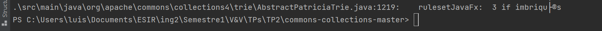
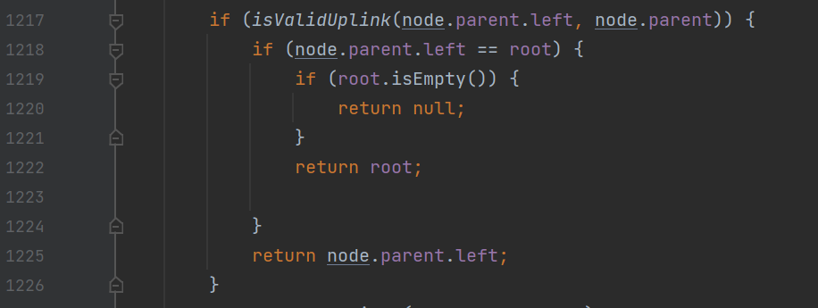

# Extending PMD

Use XPath to define a new rule for PMD to prevent complex code. The rule should detect the use of three or more nested `if` statements in Java programs so it can detect patterns like the following:

```Java
if (...) {
    ...
    if (...) {
        ...
        if (...) {
            ....
        }
    }

}
```
Notice that the nested `if`s may not be direct children of the outer `if`s. They may be written, for example, inside a `for` loop or any other statement.
Write below the XML definition of your rule.

You can find more information on extending PMD in the following link: https://pmd.github.io/latest/pmd_userdocs_extending_writing_rules_intro.html, as well as help for using `pmd-designer` [here](https://github.com/selabs-ur1/VV-ISTIC-TP2/blob/master/exercises/designer-help.md).

Use your rule with different projects and describe you findings below. See the [instructions](../sujet.md) for suggestions on the projects to use.

## Answer

Afin d'éviter le code complexity, nous écrivons une nouvelle règle en utilisant XPATH. Cette règle doit permettre de repérer l'utilisation de 3 if imbriqués. Pour définir cette règle, nous avons utilisé pmd designer qui permet de réaliser des tests directement sur la règle que nous écrivons. Une fois la règle écrite (IfStatement//IfStatement//IfStatement), nous avons généré un [fichier](../code/Exercise3/rule3If.xml) xml cette dernière. 

Pour tester cette nouvelle règle, nous avons fait une analyse avec PMD sur le projet Apache Commons Collections, ce qui nous a donné le résultat suivant :



Afin de vérifier qu'il détectait réellement des triples if imbriqués, nous sommes allés voir les emplacements indiqués.



On observe que notre règle détecte bien des triples if imbriqués.
