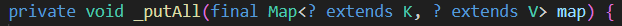
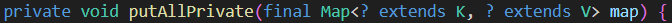
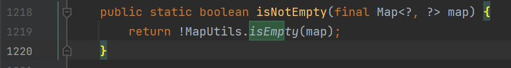

# Using PMD

Pick a Java project from Github (see the [instructions](../sujet.md) for suggestions). Run PMD on its source code using any ruleset. Describe below an issue found by PMD that you think should be solved (true positive) and include below the changes you would add to the source code. Describe below an issue found by PMD that is not worth solving (false positive). Explain why you would not solve this issue.

You can use the default [rule base](https://github.com/pmd/pmd/blob/master/pmd-java/src/main/resources/rulesets/java/quickstart.xml) available on the source repository of PMD.

## Answer

Nous avons choisi le projet Java Apache Commons Collections sur lequel nous avons lancé une analyse avec PMD sur sa source. De cette analyse est ressortie une liste de potentiels problèmes. On a sélectionné de cette liste un True positive et un False positive.

True positive : 
.\src\main\java\org\apache\commons\collections4\map\AbstractHashedMap.java:316: MethodNamingConventions:        The instance method name '_putAll' doesn't match '[a-z][a-zA-Z0-9]*'

Le problème détecté par PMD, désigne un non-respect des coding guidelines. Ainsi, si l'on rend à l'emplacement de la méthode, on observe bien ce nom respect des coding guidelines.

Pour que cette fonction respecte les coding guidelines de Java, on modifie le nom de la méthode et on applique le changement à tous les endroits où elle est appelée.

False positive : 

.\src\main\java\org\apache\commons\collections4\MapUtils.java:1219:     UnnecessaryFullyQualifiedName:  Unnecessary qualifier 'MapUtils': 'isEmpty' is already in scope

Le potentiel problème ressorti par PMD indique une utilisation qui n'est pas nécessaire du qualifieur MapUtils. Lorsque l'on se rend à l'emplacement, on observe le code suivant : 

C'est un Faux positif, car l'utilisation du qualifieur MapUtils montre et précise que la méthode “isEmpty()” utilisée provient de la classe “MapUtils”. Il est préférable de faire cela car cette méthode a été déclarée dans plusieurs autres classes telles que : 
FluentIterable
CollectionUtils
IteratorUtils
IterableUtils
etc

